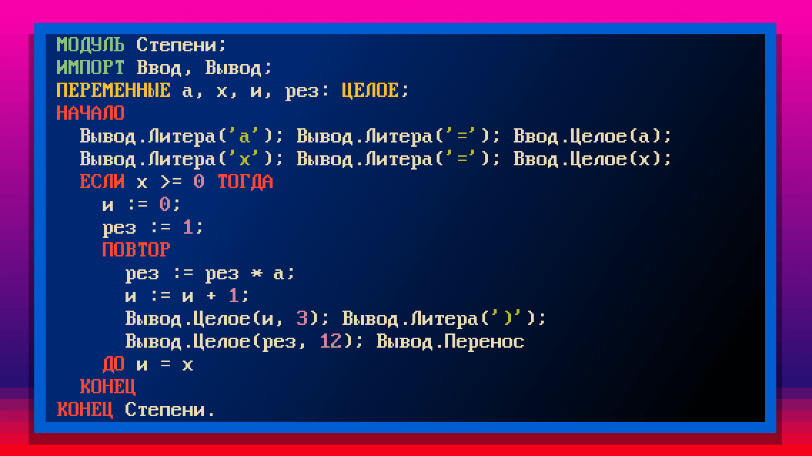
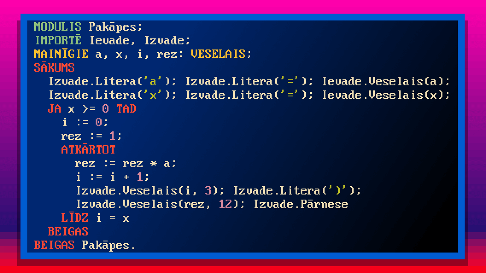
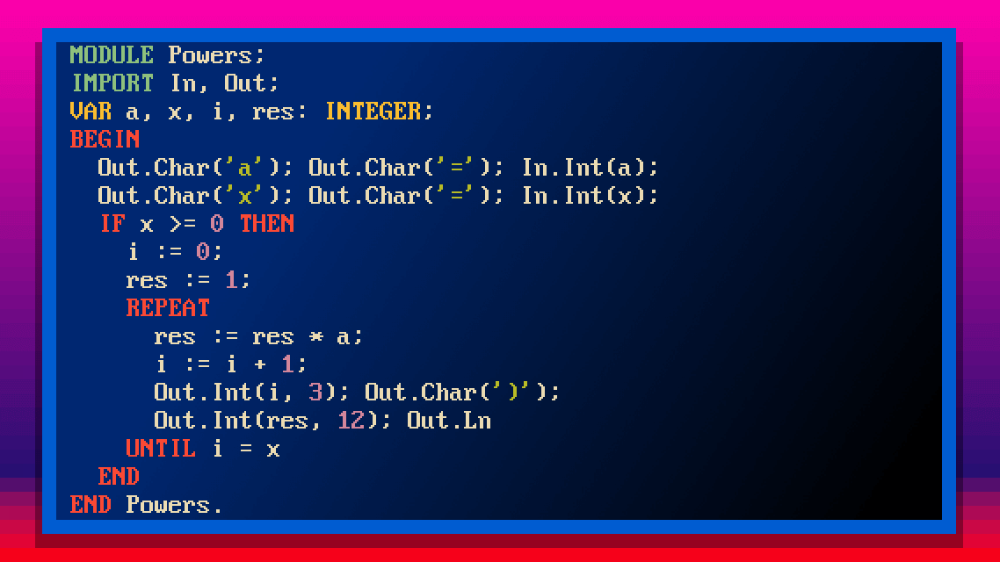

# 🌏 InterOberon: Internationalized Oberon Compiler
Write programs in Oberon in your native language!

[Video presentation](https://www.youtube.com/watch?v=6D9Oj9f8AdY) (in Russian)

# 🌏 Интер-Оберон: Интернационализованный компилятор Оберона
Пишите программы на Обероне на своём родном языке!

[Видеодоклад](https://www.youtube.com/watch?v=6D9Oj9f8AdY)

# 🌏 Inter-Oberons: Internacionālais Oberona kompilators
Rakstiet Oberon-programmas savā dzimtajā valodā!

[Video referāts](https://www.youtube.com/watch?v=6D9Oj9f8AdY)

